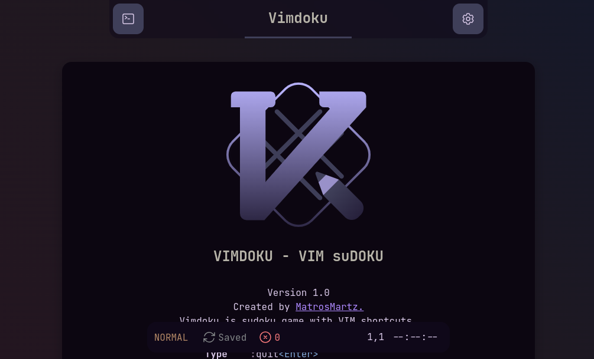
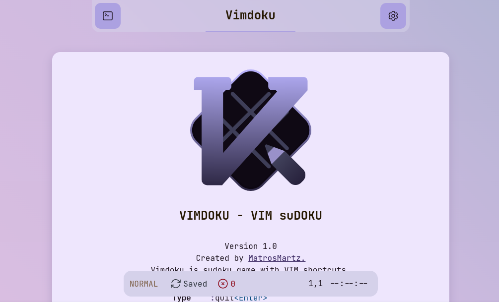

# Vimdoku - A Sudoku-like Web Game with Vim Shortcuts

Vimdoku is a unique web-based puzzle game that brings the power of Vim's keyboard shortcuts to the classic game of Sudoku. This project is built with modern web technologies, including Svelte, TypeScript, Node.js, Vite, and Vitest, to provide an enjoyable and efficient experience for Vim enthusiasts and Sudoku lovers alike.

## Features

- Vim-inspired keyboard shortcuts for navigating the game grid and inputting numbers.
- A Sudoku-like puzzle generator with varying levels of difficulty.
- Real-time validation to help you identify errors as you play.
- A clean and responsive user interface, designed with Svelte for a smooth user experience.

## Getting Started

To get started with Vimdoku, follow these simple steps:

1. Clone this repository to your local machine:

```bash
git clone https://github.com/matrosmartz/vimdoku.git
```

2.Navigate to the project directory:

```bash
cd vimdoku
```

3. Install the project dependencies using Node.js and npm:

```bash
npm install
```

4. Build and run the application in development mode:

```bash
npm run dev
```

5. Open your web browser and visit `http://localhost:5173` to start playing Vimdoku.

## How to play

- Use Vim-like keyboard shortcuts to navigate the game grid:
  - `h` - Move left
  - `j` - Move down
  - `k` - Move up
  - `l` - Move right
- To input numbers, press `i` to enter Insert mode.
- To input numbers, press `n` to enter Annotation mode.
- Use `ESC` to exit Insert or Annotation mode.
- Use the arrow keys for traditional navigation if you prefer.

## Puzzle Difficulty

Vimdoku offers puzzles with varying levels of difficulty to challenge players of all skill levels. You can choose between beginner, easy, medium, hard, etc. puzzles to test your problem-solving skills.

Example:

```vim
:st[art] easy
```

## Language

Vimdoku supports different languages for a better user experience. The currently available languages are English and Spanish. To change the language, use the following Vim commands while playing:

```vim
:se[t] language=es
```

or:

```vim
:se[t] language:es
```

This will change the user interface language to Spanish. To switch back to English, simply replace `es` with `en`.

The game is currently available in the following languages:

- Español (`es`)
- English (`en`, by default)

If you would like to contribute translations into other languages, you are more than welcome to do so.

## Color schema

Vimdoku allows you to choose between different color schemes for the game interface. You can select a color scheme using the `:set colorschema` Vim command followed by one of the following values:

- `system`: Uses the color scheme set in your system preferences
- `dark`: Applies a dark mode color scheme
- `light`: Applies a light mode color scheme

For example:

```vim
:se[t] colorschema=dark
```



```vim
:se[t] colorschema=light
```



## Validation

Vimdoku provides real-time validation, so you'll know immediately if your input is correct or if there are any errors in your solution.

To disable real-time validation, you can use the following Vim command:

```vim
:se[t] noautomaticvalidation
```

Simply enter this command in Vim while playing the game to turn off automatic validation.

To reactivate the real-time validation in Vimdoku, you can use the following Vim command:

```vim
:se[t] automaticvalidation
```

This will enable automatic validation in the game, so you can see immediately if your input is correct or if there are any errors in your solution.

I hope this helps! Let me know if you have any other questions.

## Technologies Used

- [Svelte](https://svelte.dev/): A lightweight, high-performance JavaScript framework for building user interfaces.
- [TypeScript](https://typescriptlang.org/): A strongly typed superset of JavaScript for improved code quality and maintainability.
- [Node.js](https://nodejs.org/): A JavaScript runtime for building server-side applications.
- [Vite](https://vitejs.dev/): A fast development build tool that serves your project locally with HMR (Hot Module Replacement).
- [Vitest](https://vitest.dev/): A testing library for Vite projects, making it easy to write and run tests.

## Contributing

We welcome contributions to Vimdoku. Feel free to open issues, submit pull requests, or suggest new features and improvements.

## License

Vimdoku is open-source software released under the MIT License.
